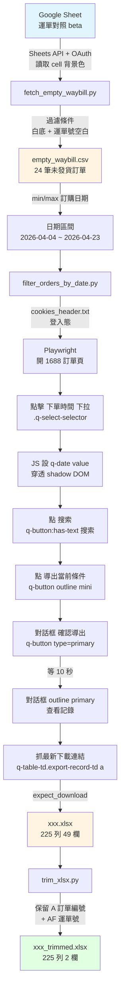

# 1688 待發貨訂單運單抓取流程

## 流程圖



## 三大階段

### 階段 1: 從 Google Sheet 取得日期範圍

**輸入**: Google Sheet `1TlBDX9TlH1NoxkvL2bfhOzHMPcHRtMwkLd8AlrIzyjQ`,gid `1255614457`(運單對照 beta)

**處理**:
- OAuth 登入(`client_secret_*.json` → `token.json`)
- 透過 `spreadsheets.get(includeGridData=True)` 讀取連同格式的儲存格資料
- 過濾規則:
  - A 欄背景色 = 白色 `#ffffff`(排除淺灰 1 `#d9d9d9` 已處理 + 淺黃 `#fff2cc` 標題)
  - 訂單編號是長數字
  - F 欄(運單號)為空
- 計算最早 / 最晚訂購日期

**輸出**:
- `empty_waybill.csv` — 24 筆白底 + 運單空缺訂單
- 日期區間: `2026-04-04` ~ `2026-04-23`

### 階段 2: 自動化 1688 操作

**輸入**: `empty_waybill.csv`(取日期範圍),`cookies_header.txt`(登入態)

**Playwright 步驟**:
1. 開啟 `https://air.1688.com/app/ctf-page/trade-order-list/buyer-order-list.html?tradeStatus=waitbuyerreceive...`
2. 點擊「下單時間」`.q-select-selector`(下拉選單)
3. **關鍵技巧**: `<q-date>` 是 Web Component(內含 shadow DOM 的 `<ui-datetime readonly>`),無法直接鍵盤輸入。改用 Playwright 的 `locator.evaluate()` 直接設 `value` 屬性 + 派發 `input/change/q-change` 事件
4. 點搜索 `q-button:has-text("搜索")`
5. 點「導出當前條件」`q-button:has-text("导出当前条件")`
6. 對話框實心 primary `q-button[type="primary"][modal-component="true"]:not([outline]):visible`(過濾掉同 DOM 內隱藏的對話框模板)
7. 等 10 秒讓導出處理
8. 對話框 outline primary `q-button[type="primary"][modal-component="true"][outline]:visible`(展開記錄)
9. 取最新一筆下載連結 `q-table-td.export-record-td a`(第一列 = 最新)
10. `page.expect_download()` 接 xlsx 檔

**輸出**: `<timestamp>.xlsx` — 225 列 × 49 欄

### 階段 3: 後處理

**處理**: `openpyxl` 讀檔,新建只含「訂單編號」「運單號」兩欄的工作簿

**注意**: 原檔有「同訂單多 SKU」造成的合併儲存格副作用(子列只有運單號,訂單編號為空)

**輸出**: `<timestamp>_trimmed.xlsx`

## 檔案清單

| 檔案 | 用途 |
|---|---|
| `client_secret_*.json` | Google OAuth 憑證(Desktop App)|
| `token.json` | OAuth 授權 token(自動產生 / 重複使用)|
| `cookies_header.txt` | 1688 登入 cookie(瀏覽器 Copy as cURL 取得)|
| `cookies.txt` | (Netscape 格式 cookies 備份)|
| `login_1688.py` | 用 cookie 開 1688(早期測試)|
| `fetch_sheet.py` | 抓 Sheet 中所有「非淺灰底」資料(早期版)|
| **`fetch_empty_waybill.py`** | **階段 1:輸出 24 筆 + 日期** |
| **`filter_orders_by_date.py`** | **階段 2:Playwright 自動化 + 下載 xlsx** |
| **`trim_xlsx.py`** | **階段 3:精簡欄位** |
| `empty_waybill.csv` | 階段 1 輸出 |
| `<timestamp>.xlsx` | 階段 2 下載 |
| `<timestamp>_trimmed.xlsx` | 階段 3 輸出 |
| `debug_*.py` / `*.png` | 除錯腳本 / 截圖 |

## 一鍵執行

```bash
# 階段 1: 取得日期範圍 + 訂單清單
python d:/1688excel/fetch_empty_waybill.py

# 階段 2: 自動套日期 + 下載 xlsx
python d:/1688excel/filter_orders_by_date.py

# 階段 3: 精簡為 2 欄
python d:/1688excel/trim_xlsx.py
```

## 關鍵踩雷

1. **Google Sheet 顏色判斷**: `淺灰色 1 = #d9d9d9`(±8 容差);`document.querySelector` 搜尋 Sheets API 回傳的 cell 背景需走 `effectiveFormat.backgroundColor` 浮點 0~1 RGB,× 255 換算
2. **Web Component shadow DOM**: `document.querySelector('q-date')` 找不到(在 shadow root 內);Playwright `page.locator()` 預設能穿透 shadow,但 `page.evaluate()` 不行 — 改用 `locator.evaluate()`
3. **`readonly` 偽輸入框**: `<q-date>` 內的 `<ui-datetime readonly>` 是顯示用,不能 `.fill()`,要設外層 `<q-date>` 的 `value` 屬性 + 派發事件
4. **隱藏對話框模板**: 1688 頁面預先把多個 dialog 都塞 DOM,只是 hidden;選器要加 `:visible`
5. **`accept_downloads=True`**: `browser.new_context()` 預設不接收下載,要顯式開
6. **openpyxl `delete_cols`**: 不會清除最大欄寬參考,`max_col` 仍會是原值;改用「複製到新 workbook」做法
