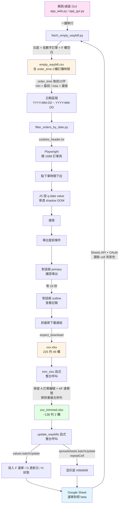

# 1688 待發貨訂單運單抓取流程

## 流程圖



## 兩階段(GUI 一鍵)

### 階段 1: 從 Google Sheet 取得日期範圍 (`fetch_empty_waybill.py`)

讀取 `運單對照(beta)` 工作表(gid `1255614457`),把連同**儲存格背景色**一起拉下來,過濾規則:

- A 欄背景色 = 白色 `#ffffff`(排除淺灰 1 `#d9d9d9` 已處理 + 淺黃 `#fff2cc` 標題)
- 訂單編號是長數字(>10 位)
- F 欄(運單號)為空

**🔑 1688 日期偵測邏輯**(這是後面要丟給 1688「下單時間」篩選的關鍵):

| 步驟 | 來源 / 動作 |
|---|---|
| 1. 鎖定欄位 | **C 欄 (index 2) `訂購時間`** — 不是付款時間、不是更新日 |
| 2. 過濾資料 | 上述 3 條件(白底 + 長數字訂單編號 + F 空)|
| 3. 取日期 | 各列 `訂購時間` 字串前 10 字 `YYYY-MM-DD`(去掉時分秒)|
| 4. 計算範圍 | 字串排序後 `dates[0]` = 最前、`dates[-1]` = 最後 |
| 5. 傳遞 | 寫入 `empty_waybill.csv` 的 `order_time` 欄,階段 2 再透過 `get_date_range()` 讀回 |

範例:今天跑出的 25 筆資料分布在 4/21、4/24、4/27 → 偵測結果 = `2026-04-21 ~ 2026-04-27`,後面 1688 「下單時間」就會自動套這個區間。

**為什麼用「訂購時間」而非「付款時間」**:
- 訂購時間每筆訂單都有(下單即產生),最穩定
- 付款時間可能空白(未付款訂單,例如 18 筆未付款)
- 1688 下單時間篩選的語義也是 `訂購` 那刻

**輸出**:
- `empty_waybill.csv` — 待補運單訂單明細(包含 order_time 欄供下游使用)
- 印出 `=== 最前/最後日期 ===` 區段

### 階段 2: Playwright 自動化 + 精簡 + 回填 (`filter_orders_by_date.py`)

整合三段邏輯,跑完一條龍:

#### 2-1. 1688 自動操作
1. 用 `cookies_header.txt` 登入 → 開訂單頁(`tradeStatus=waitbuyerreceive`)
2. **`get_date_range()`** 從 `empty_waybill.csv` 讀 `order_time` 欄 → 排序取最前/最後當作 1688 篩選日期
3. 點「下單時間」`.q-select-selector`
4. **shadow DOM 穿透**:`<q-date>` 是 Web Component(內含 `<ui-datetime readonly>`),不能直接打字。用 Playwright `locator.evaluate()` 設 `value = "YYYY-MM-DD"` 屬性 + 派發 `input/change/q-change` 事件 — 兩個 `<q-date>` 分別填最前 / 最後日期
5. 點 `q-button:has-text("搜索")`
6. 點 `q-button:has-text("导出当前条件")`
7. 對話框實心 primary `q-button[type="primary"][modal-component="true"]:not([outline]):visible`(過濾隱藏模板)
8. 等 10 秒
9. 對話框 outline primary 展開記錄
10. 抓最新下載連結 `q-table-td.export-record-td a`(第一列)
11. `expect_download()` 接 xlsx → 存到本地

#### 2-2. 精簡 xlsx (`trim_xlsx` 函式)
- `openpyxl` 重建只含「訂單編號 / 運單號」兩欄的新檔
- **去重**:訂單編號為空 + 運單號重複 → 跳過(合併儲存格副作用)
- 輸出 `<timestamp>_trimmed.xlsx`

#### 2-3. 回填 Google Sheet (`update_waybills` 函式)
讀 trimmed xlsx → 建立 `order_id → waybill` mapping → 對 Sheet 每列套規則:

| 條件 | F 運單 | G 更新日 | H 狀態 | 底色 |
|---|---|---|---|---|
| F 空 + 在 xlsx + **運單 = 抓出貨表 (BC 欄)** | 寫入 | 今天 | `>>TW` | **淺灰 1** |
| F 空 + 在 xlsx + 不一致 | 寫入 | 今天 | `廠商 >> 倉庫` | (不動) |
| F 空 + 不在 xlsx + H 空 | (不動) | (不動) | `廠商未發貨` | (不動) |
| 其他 | (不動) | (不動) | (不動) | (不動) |

兩階段 API:
1. `spreadsheets.values.batchUpdate` 寫文字
2. `spreadsheets.batchUpdate` 用 `repeatCell + userEnteredFormat.backgroundColor` 塗整列灰底

## 介面層

### 網頁版 `app_web.py` (推薦)
Flask + SSE 即時串流,深色 Consolas 主題

啟動:
```bash
python d:/1688excel/app_web.py
```
自動開瀏覽器到 `http://127.0.0.1:5000`

按鈕:
- ▶ **一鍵執行** — 依序跑階段 1→2,後端 thread 不阻塞
- 📋 **複製全部 LOG** — 含時間戳的完整日誌
- ⚠ **複製錯誤** — 標紅錯誤行 + 階段標籤
- ✓ **複製動作摘要** — 「已X / 完成 / 統計」類關鍵動作 + 編號
- 🗑 **清除** — 重置面板

技術:
- SSE `/stream` 推送,連線中斷自動重連 + 15s keep-alive
- 1.5s 輪詢狀態列(目前階段 / 計數)
- 重新整理會載入 backlog
- 多分頁同步輸出

### 桌面版 `app_gui.py`
tkinter 內建,功能對等。執行 `python app_gui.py`

## 檔案清單

| 檔案 | 用途 |
|---|---|
| `client_secret_*.json` | Google OAuth 憑證(Desktop App)|
| `token.json` | OAuth 授權 token(`spreadsheets` 寫入 scope)|
| `cookies_header.txt` | 1688 登入 cookie |
| **`fetch_empty_waybill.py`** | **階段 1:取空運單清單 + 日期** |
| **`filter_orders_by_date.py`** | **階段 2:Playwright + trim + 回填(整合)** |
| **`trim_xlsx.py`** | xlsx 精簡(可獨立執行,也被 import)|
| **`update_waybills.py`** | Sheet 回填邏輯(可獨立,也被 import)|
| **`app_web.py`** | **網頁 GUI(Flask + SSE)** |
| **`app_gui.py`** | **桌面 GUI(tkinter)** |
| `login_1688.py` | 早期 cookie 登入測試 |
| `fetch_sheet.py` | 早期 Sheet 讀取(僅過濾灰底)|
| `verify_colors.py` | 顏色判斷驗證工具 |
| `debug_*.py` / `*.png` | 除錯腳本 / 截圖 |
| `empty_waybill.csv` | 階段 1 輸出 |
| `*.xlsx` / `*_trimmed.xlsx` | 階段 2 下載 / 精簡輸出 |
| `FLOW.md` | 本文件 |

## 一鍵執行

**最簡單**(網頁):
```bash
python d:/1688excel/app_web.py
```

**命令列**:
```bash
python d:/1688excel/fetch_empty_waybill.py     # 階段 1
python d:/1688excel/filter_orders_by_date.py   # 階段 2(已整合 trim + 回填)
```

**個別工具**(可獨立跑):
```bash
python d:/1688excel/trim_xlsx.py               # 只精簡最新 xlsx
python d:/1688excel/update_waybills.py         # 用現有 trimmed.xlsx 回填 Sheet
```

## 關鍵踩雷

1. **Google Sheet 顏色判斷**: 淺灰 1 = `#d9d9d9`(±8 容差);Sheets API 回傳的 `effectiveFormat.backgroundColor` 是 0~1 浮點 RGB,需 × 255 換算
2. **Web Component shadow DOM**: `document.querySelector('q-date')` 找不到(在 shadow root 內);Playwright `page.locator()` 預設穿透 shadow,但 `page.evaluate()` 不能 — 改用 `locator.evaluate()`
3. **`readonly` 偽輸入框**: `<q-date>` 內的 `<ui-datetime readonly>` 不能 `.fill()`,要設外層 `<q-date>` 的 `value` 屬性 + 派發事件
4. **隱藏對話框模板**: 1688 把多個 dialog 都塞 DOM,只是 hidden;選器要加 `:visible`
5. **`accept_downloads=True`**: `browser.new_context()` 預設不接收下載,要顯式開
6. **openpyxl `delete_cols`**: 不會清除最大欄寬參考,`max_col` 仍是原值;改用「複製到新 workbook」做法
7. **OAuth scope 升級**: token 從 readonly 改為 read-write 時,`refresh()` 會回 `invalid_scope`,需刪除 token 重新走 InstalledAppFlow
8. **大數字精度**: 19 位訂單編號用 `valueRenderOption=UNFORMATTED_VALUE` 可能被當 number,精度只剩 15 位;用預設 `FORMATTED_VALUE` 拿字串
9. **訂單編號合併儲存格**: 1688 匯出 xlsx 同訂單多 SKU 共用第一列,後續列訂單編號為空但運單號重複 — 去重要鎖「重複運單 + 空編號」雙條件
10. **subprocess 串流**: GUI 跑子腳本要 `python -u`(unbuffered)+ `PYTHONIOENCODING=utf-8` + `bufsize=1`,輸出才會即時
